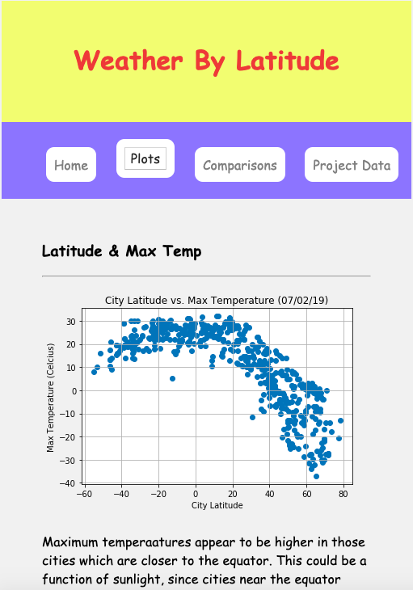
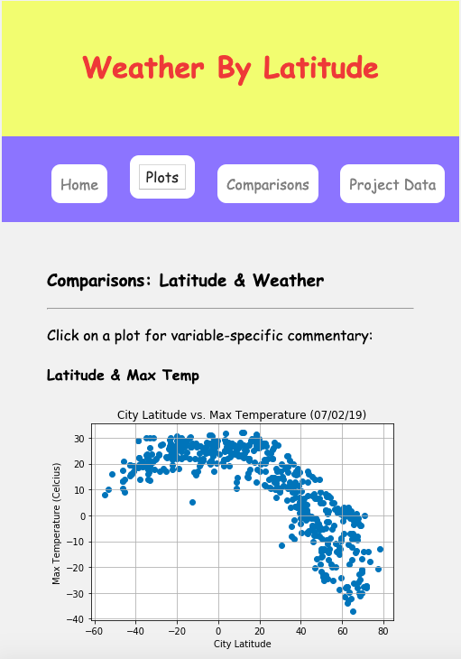
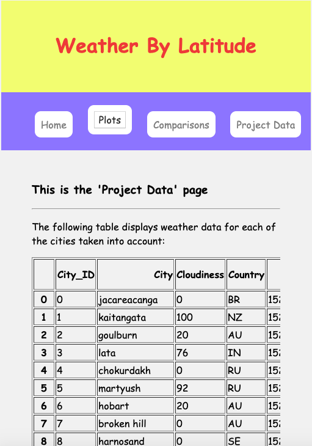

# HTML-Latitude-Weather
This program uses HTML to display the data obtained using the [Python-API-Weather](https://github.com/finnwurtz/Python-API-Weather) program.

Technologies Used: Python, Pandas, Jupyter Notebook, HTML, CSS

In this program, a [Jupyter](https://jupyter.org/) Notebook converts weather data from CSV to HTML, allowing it to be viewed in a web browser using a [local server](https://developer.mozilla.org/en-US/docs/Learn/Common_questions/set_up_a_local_testing_server). The program is designed to organize information about weather patterns into a straightforward and easy-to-navigate website. A webpage is included for each of several weather variables. Most of the webpages include graphs that illustrate the relationship between latitude and various weather variables; several of them also include supplemental commentary.

At the top of each webpage, a series of buttons allows visitors to navigate between each of the pages that make up the site. Visitors who click on the 'Plots' drop-down menu can choose between several pages, each of which displays a graph and a short commentary for one of the weather variables being analyzed. To view all of the graphs in one place, visitors can click on the 'Comparisons' page, which displays them together and omits the commentary. The 'Project Data' page gives visitors access to the data used to make the visualizations, while the 'Home' button brings visitors back to the home page. The [Comic Sans typeface](https://docs.microsoft.com/en-us/typography/font-list/comic-sans-ms) was chosen for its demonstrated ability to facilitate [memory retention](https://www.princeton.edu/news/2010/10/28/font-focus-making-ideas-harder-read-may-make-them-easier-retain). The site is written using a combination of HTML & CSS.

/

